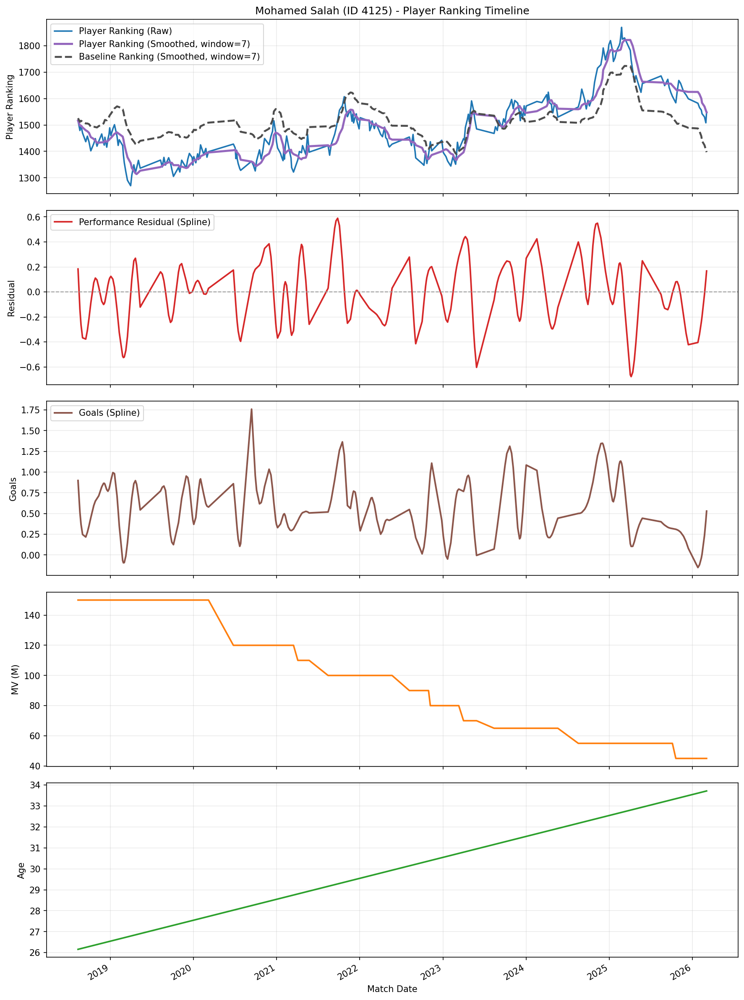

# Player Ranking (Market + Age Adjusted)

Attacker-focused, config-driven player ranking model that compares observed player performance to an expectation built from:

- player pre-match ranking
- age relative to position peak
- market value context (optional, position-normalized and team-context-normalized options)
- opponent team strength and home advantage

The full mathematical report and evaluation details are in `docs/`.

## Model Summary

For each player-match row:

```text
R_eff = R_player_pre
      + beta_mv * z_mv
      + beta_mv_team * z_mv_team_context
      - beta_age * (age - peak_age_pos)^2
```

```text
E = 1 / (1 + 10^(-(R_eff + H - R_opp_pre) / elo_scale))
residual = S_observed - E
```

where `S_observed` is the player performance target (`scored_binary` by default).

## How Ranking Updates Work

The post-match update is:

```text
R_post = R_pre + K_eff * (S_observed - E)
```

with:

- `K_eff = player_k_factor * min(minutes_played/90, 1)` when minute-scaling is enabled
- optional team-relative mode:
  - update signal becomes `(S_player - E_player) - (S_team - E_team)`

## How to Interpret Results

- `expected_score`: model expectation for the player in that match
- `performance_residual > 0`: overperformance vs expectation
- `performance_residual < 0`: underperformance vs expectation
- `effective_player_rating`: pre-match ranking after age/MV adjustments
- `market_value_adjustment`, `market_value_team_adjustment`, `age_adjustment`: decomposition of what shifted ranking expectation

## Example Plot (Mohamed Salah)

Raw + smoothed player ranking over time, with market value and age (age on the lowest panel):



Interactive version:
- [docs/assets/mohamed_salah_player_ranking_timeline_20260305.html](docs/assets/mohamed_salah_player_ranking_timeline_20260305.html)
- [outputs/plots/mohamed_salah_player_ranking_timeline_20260305.html](outputs/plots/mohamed_salah_player_ranking_timeline_20260305.html)

## Optimization Objective (Loss)

Parameter search (`--grid-search` with `--search-strategy grid|bayes`) selects parameters by minimizing `objective_value` on the chosen split.

- Default objective is `validation` + `log_loss` (`--objective-split validation --objective-metric log_loss`).
- Supported objective metrics:
  - `log_loss` (binary cross-entropy on `observed_performance_score` vs `expected_score`)
  - `brier_score` (mean squared probability error)
  - `mean_residual` (mean of `performance_residual`)
- Internal optimization target:
  - `objective_value = metric` for `log_loss` and `brier_score`
  - `objective_value = abs(mean_residual)` for `mean_residual`
- Ties are broken by lower `test_log_loss`, then parameter order.

## How To Use

### Run backtest

```bash
python3 scripts/run_backtest_market_age_adjusted_elo.py \
  --players data/elo_base_players.csv \
  --fixtures data/elo_base_fixtures.csv \
  --config config/market_age_adjusted_elo.yaml \
  --output-dir outputs/market_age_adjusted_elo
```

### Run beta grid search

```bash
python3 scripts/run_backtest_market_age_adjusted_elo.py \
  --players data/elo_base_players.csv \
  --fixtures data/elo_base_fixtures.csv \
  --config config/market_age_adjusted_elo.yaml \
  --grid-search \
  --beta-mv-grid "0,6,12,18,24,30" \
  --beta-mv-team-grid "0,5,10,15" \
  --beta-age-grid "0,0.6,1.2,1.8,2.4" \
  --player-k-grid "10,20,30" \
  --objective-split validation \
  --objective-metric log_loss \
  --output-dir outputs/market_age_adjusted_elo_grid
```

### Run Bayesian optimization (advanced search)

```bash
python3 scripts/run_backtest_market_age_adjusted_elo.py \
  --players data/elo_base_players.csv \
  --fixtures data/elo_base_fixtures.csv \
  --config config/market_age_adjusted_elo.yaml \
  --grid-search \
  --search-strategy bayes \
  --beta-mv-bounds "0,30" \
  --beta-mv-team-bounds "0,20" \
  --beta-age-bounds "0,3" \
  --player-k-bounds "5,40" \
  --bayes-initial-points 10 \
  --bayes-iterations 30 \
  --bayes-candidate-pool 2000 \
  --objective-split validation \
  --objective-metric log_loss \
  --output-dir outputs/market_age_adjusted_elo_bayes
```

### Plot player ranking timeline

```bash
python3 scripts/plot_player_elo_timeline.py \
  --input-csv outputs/market_age_adjusted_elo_grid_wide_mv_k_rerun_20260304/best_model_backtest/player_match_outputs_market_age.csv \
  --baseline-input-csv outputs/market_age_adjusted_elo_grid_wide_mv_k_rerun_20260304/best_model_backtest/player_match_outputs_baseline.csv \
  --player-id 4125 \
  --ranking-col player_elo_post \
  --residual-col performance_residual \
  --smooth-window 7 \
  --residual-spline-strength 0.75 \
  --backend plotly \
  --output-path outputs/plots/mohamed_salah_player_ranking_timeline_20260305.html
```

### Overlay mode (single figure, multi-axis)

```bash
python3 scripts/plot_player_elo_timeline.py \
  --input-csv outputs/market_age_adjusted_elo_grid_wide_mv_k_rerun_20260304/best_model_backtest/player_match_outputs_market_age.csv \
  --player-name "Mohamed Salah" \
  --backend plotly \
  --overlay \
  --output-path outputs/plots/mohamed_salah_overlay.html
```

- Residual smoothing spline is enabled by default; disable with `--disable-residual-spline`.
- If `--baseline-input-csv` is omitted, the script auto-detects `player_match_outputs_baseline.csv` next to the input CSV when available.

## Notes

- Scope is attacker-only by default (`position_filter: [ATT]`).
- Fixture-level precomputed team ELO is used when present; otherwise fixture team ELO pre-ratings are derived sequentially from results.
- Market-value normalization is fit on training split only to avoid leakage.
- Set `use_team_market_value_context: true` to add a second market-value context normalized within a team-aware grouping (`season+league+team_id+position_group` by default), with coefficient `beta_mv_team`.
- Set `use_player_vs_team_relative_update: true` in config to update player ELO using player residual relative to team residual (`(S_player-E_player) - (S_team-E_team)`).
